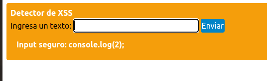

# XSS Finder

Este proyecto es una aplicación web sencilla creada con Flask que permite detectar posibles intentos de Cross-Site Scripting (XSS) en el input de los usuarios. La aplicación escapa el input proporcionado y muestra un mensaje si detecta algún intento de XSS.

## Requisitos

- Python 3.x
- Flask
- MarkupSafe

## Instalación

1. Clona este repositorio:

    ```sh
    git clone https://github.com/tu-usuario/xss-finder.git
    cd xss-finder
    ```

2. Crea un entorno virtual:

    ```sh
    python -m venv venv
    ```

3. Activa el entorno virtual:

    - En Windows:

        ```sh
        venv\Scripts\activate
        ```

    - En MacOS/Linux:

        ```sh
        source venv/bin/activate
        ```

4. Instala las dependencias:

    ```sh
    pip install Flask markupsafe
    ```

## Uso

1. Ejecuta la aplicación Flask:

    ```sh
    python app.py
    ```

2. Abre tu navegador y ve a `http://127.0.0.1:5000/`.

3. Ingresa un texto en el formulario y envíalo. Si el texto contiene un posible intento de XSS, se mostrará un mensaje indicando la detección del mismo.

## Contribuciones

Las contribuciones son bienvenidas. Por favor, abre un issue o envía un pull request para cualquier mejora o corrección.

## Licencia

Este proyecto está bajo la Licencia MIT. Consulta el archivo `LICENSE` para más detalles.

